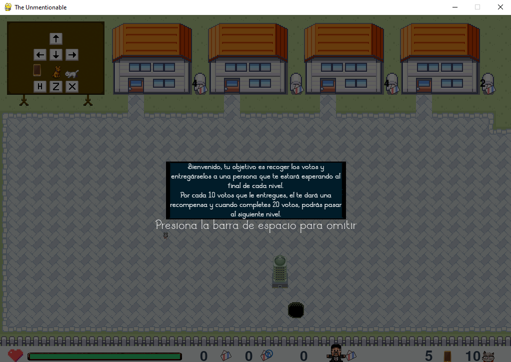
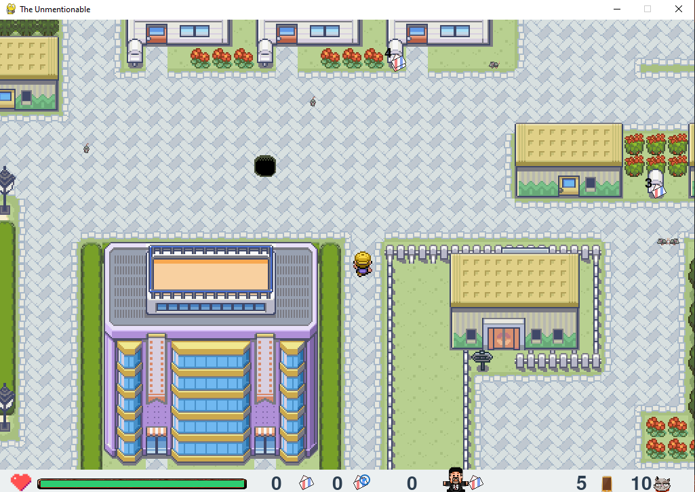
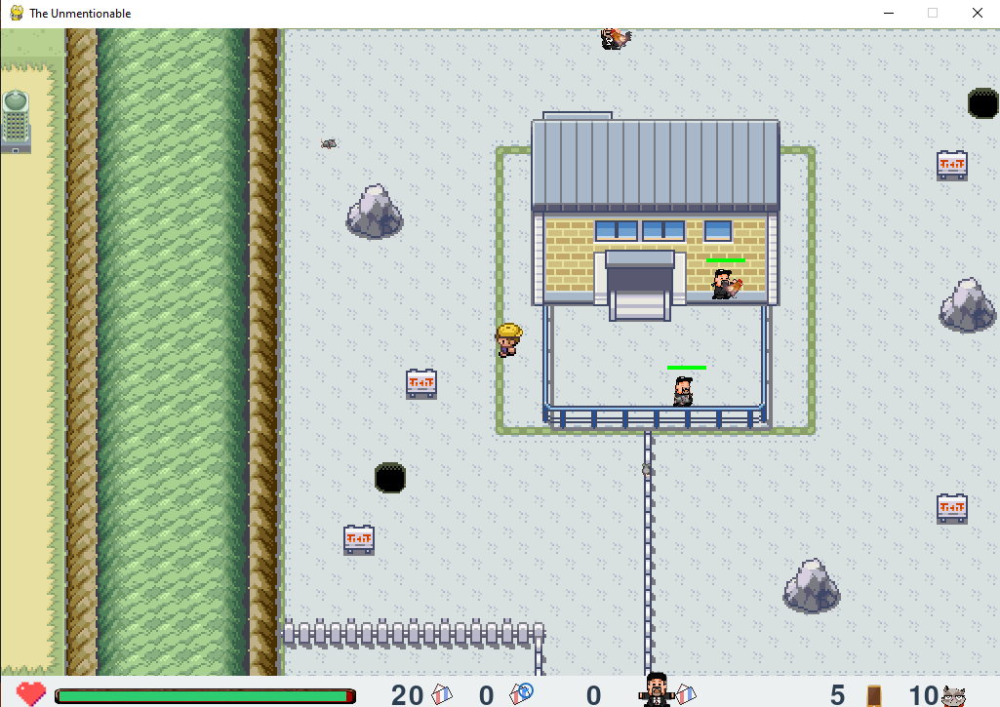
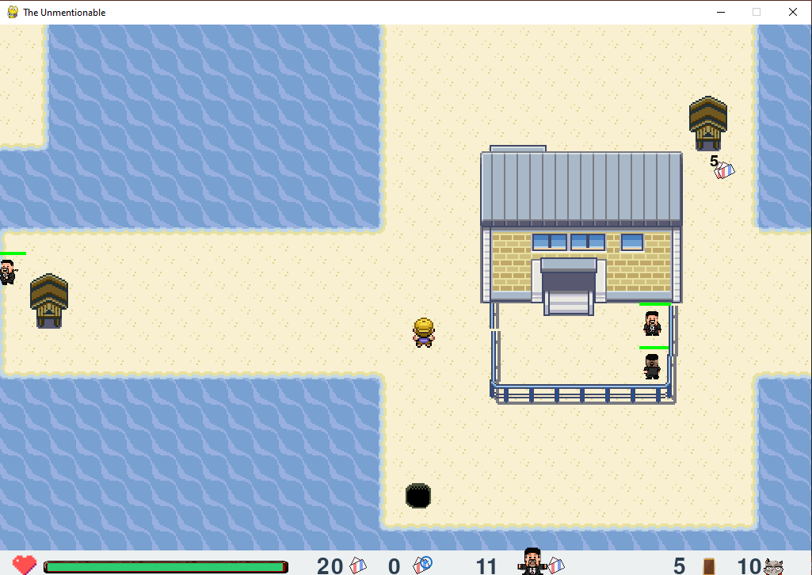

# The unmentionable
Este juego te lleva a la gran aventura de salvar las votaciones, en un pais desconocido, de un candidato inombrabñe, el cual tiene muchos aliados que manipulan los votos de los ciudadanos y unas ratas que se roban dichos votos.  
## Requerimientos
Tener instalado pygame y Python 3.7 >.  
Puede instalar la libreria usando el siguiente comando:

```
pip install -r requirements.txt    
```
## Tutorial 


## Escenarios

Explora 4 distintos escenarios, cada uno con enemigos por derrotar y votos por reclamar, cumple el objetivo en cada escenario y enfrenta al jefe que esta detras de todo esto.

</img>
</img>
</img>

